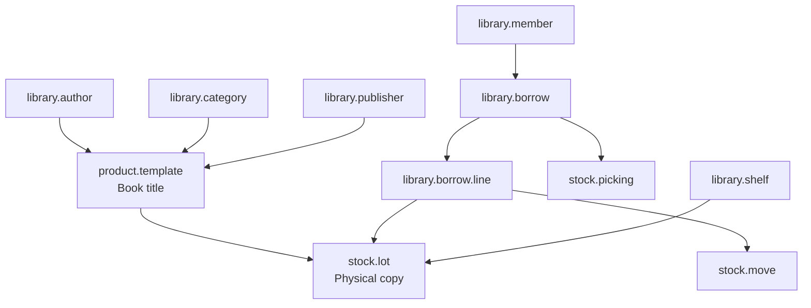

# Library Management Handoff

## Purpose

This document is the source of truth for agents and LLMs that need to understand or continue the `library_management` module.
It describes the current architecture, the real workflow implemented in code, and the remaining gaps that should be addressed next.

## Current Module State

- Odoo version target: 16.0
- Main functional scope: book catalog, physical copies, members, borrow/return workflow, dashboard
- Inventory integration: `product`, `stock`, and `stock.lot`
- Backend dashboard: OWL client action + backend assets
- Current source of truth for file wiring: [__manifest__.py](../__manifest__.py)

## High-Level Architecture

## Real Workflow Implemented in Code

### 1. Catalog setup

- Books are stored as `product.template` records with `is_library_book = True`.
- Metadata fields live on product template:
  - `isbn`
  - `author_id`
  - `category_id`
  - `publisher_id`
  - `publish_year`
  - `language`
  - `edition`
  - `description_library`
  - `cover_image`
- Author, category, and publisher are separate master data models.

### 2. Physical copies

- Each physical copy is represented by `stock.lot`.
- The lot stores library-specific fields such as:
  - `shelf_id`
  - `borrow_line_ids`
  - `note`
  - `condition`
  - `borrow_count`
- The current code treats the lot as the copy-level tracking object, not a separate `library.book.copy` model.

### 3. Member management

- `library.member` stores reader/member data.
- Borrow history and counters are computed from linked borrow records.
- `action_view_borrows()` opens the member borrow history.

### 4. Borrow flow

- `library.borrow` is the main transaction document.
- `library.borrow.line` stores one line per book copy.
- Borrow states:
  - `draft`
  - `confirmed`
  - `borrowed`
  - `returned`
  - `cancel`
- Confirming a borrow creates a stock picking and stock moves.
- Borrowing validates the picking and assigns serial/lot values.
- Returning creates an inbound picking back to the library location.

### 5. Shelf flow

- `library.shelf` groups physical copies by location/zone/floor/code.
- Shelf form exposes linked copies via `lot_ids`.
- Shelf smart button opens the copy list for that shelf.

### 6. Dashboard

- Dashboard is an OWL client action registered by `views/dashboard_views.xml` and loaded through backend assets.
- Dashboard data comes from `library.borrow.get_library_dashboard_data()`.
- The UI shows KPI cards and charts for books, members, and borrows.

## Key Files And Responsibilities

### Manifest and bootstrapping

- [__manifest__.py](../__manifest__.py): module wiring, data files, assets
- [__init__.py](../__init__.py): Python package entry point
- [models/__init__.py](../models/__init__.py): imports all active models

### Business models

- [models/product_template.py](../models/product_template.py): book metadata and product-level stats
- [models/library_author.py](../models/library_author.py): author master data
- [models/library_category.py](../models/library_category.py): category master data
- [models/library_publisher.py](../models/library_publisher.py): publisher master data
- [models/library_member.py](../models/library_member.py): member data and borrow KPIs
- [models/library_borrow.py](../models/library_borrow.py): borrow lifecycle and stock integration
- [models/library_borrow_line.py](../models/library_borrow_line.py): borrow lines
- [models/library_self.py](../models/library_self.py): shelf model
- [models/stock_production_lot.py](../models/stock_production_lot.py): copy-level tracking on stock lots
- [models/stock_location.py](../models/stock_location.py): library-specific stock location flag
- [models/stock_move.py](../models/stock_move.py): borrow-line back-reference on moves
- [models/stock_picking.py](../models/stock_picking.py): borrow back-reference on pickings
- [models/library_fine.py](../models/library_fine.py): fine model placeholder, not yet wired into the workflow

### Views and UI

- [views/product_template_views.xml](../views/product_template_views.xml): book catalog UI
- [views/library_author_views.xml](../views/library_author_views.xml): author views and action
- [views/category_views.xml](../views/category_views.xml): category views and action
- [views/publisher_views.xml](../views/publisher_views.xml): publisher views and action
- [views/self_views.xml](../views/self_views.xml): shelf views and action
- [views/stock_production_lot_views.xml](../views/stock_production_lot_views.xml): copy views and action
- [views/library_member_views.xml](../views/library_member_views.xml): member views and action
- [views/library_borrow_views.xml](../views/library_borrow_views.xml): borrow views and action
- [views/library_menu.xml](../views/library_menu.xml): navigation structure
- [views/dashboard_views.xml](../views/dashboard_views.xml): dashboard client action

### Data and security

- [data/ir_sequence.xml](../data/ir_sequence.xml): numbering for borrow/member/copy records
- [data/stock_location.xml](../data/stock_location.xml): library stock locations
- [data/stock_picking_type.xml](../data/stock_picking_type.xml): picking types for borrow/return flow
- [security/library_security.xml](../security/library_security.xml): access rules / group setup
- [security/ir.model.access.csv](../security/ir.model.access.csv): access rights

### Frontend assets

- [static/src/js/dashboard.js](../static/src/js/dashboard.js): OWL dashboard logic
- [static/src/xml/dashboard.xml](../static/src/xml/dashboard.xml): dashboard templates
- [static/src/css/dashboard.css](../static/src/css/dashboard.css): dashboard styles

## What To Trust

When extending the module, trust the code that is loaded by the manifest, not the older files left in the repository.

### Loaded workflow files

- [views/product_template_views.xml](../views/product_template_views.xml)
- [views/library_author_views.xml](../views/library_author_views.xml)
- [views/category_views.xml](../views/category_views.xml)
- [views/publisher_views.xml](../views/publisher_views.xml)
- [views/self_views.xml](../views/self_views.xml)
- [views/stock_production_lot_views.xml](../views/stock_production_lot_views.xml)
- [views/library_member_views.xml](../views/library_member_views.xml)
- [views/library_borrow_views.xml](../views/library_borrow_views.xml)
- [views/library_menu.xml](../views/library_menu.xml)
- [views/dashboard_views.xml](../views/dashboard_views.xml)

### Legacy files to treat carefully

- [views/library_book_views.xml](../views/library_book_views.xml): legacy copy UI, not loaded by the manifest
- [views/book_views.xml](../views/book_views.xml): not present in the current file tree
- [views/author_views.xml](../views/author_views.xml): not present in the current file tree
- [views/member_views.xml](../views/member_views.xml): not present in the current file tree
- [views/borrow_views.xml](../views/borrow_views.xml): not present in the current file tree

## Extension Rules For Future Agents

- Keep the workflow anchored on the files loaded in `__manifest__.py`.
- Do not reintroduce `library.book.copy` unless you intend to migrate the current copy model away from `stock.lot`.
- If you add a new workflow step, update both the Python model and the corresponding view/action/menu.
- If you add a new loadable XML file, register it in `__manifest__.py`.
- If you touch dashboard data, keep the backend method and OWL template keys in sync.
- If you wire `library.fine`, update borrow return logic and access rules together.

## Suggested Next Work

1. Remove or archive the legacy `views/library_book_views.xml` to avoid confusion.
2. Add missing model/view tests or a documented manual QA checklist.
3. Decide whether `library.fine` should become part of the active workflow.
4. Consider adding a dedicated markdown file for runtime validation steps if you plan to continue evolving the module.
