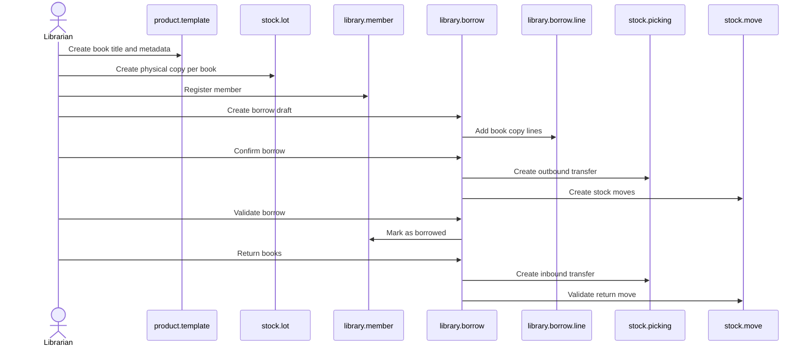

# Library Workflow

## End-To-End Flow

## Business States

### Borrow

- `draft`: editable, lines can be changed
- `confirmed`: validated business rules, stock picking created
- `borrowed`: stock has been assigned/validated
- `returned`: books have come back
- `cancel`: borrow cancelled before completion

### Copy condition

- `new`
- `good`
- `damaged`
- `lost`

## UI Entry Points

- Dashboard: [views/dashboard_views.xml](../views/dashboard_views.xml)
- Books: [views/product_template_views.xml](../views/product_template_views.xml)
- Copies: [views/stock_production_lot_views.xml](../views/stock_production_lot_views.xml)
- Members: [views/library_member_views.xml](../views/library_member_views.xml)
- Borrows: [views/library_borrow_views.xml](../views/library_borrow_views.xml)
- Catalog master data: [views/library_author_views.xml](../views/library_author_views.xml), [views/category_views.xml](../views/category_views.xml), [views/publisher_views.xml](../views/publisher_views.xml)
- Shelves: [views/self_views.xml](../views/self_views.xml)

## Data Dependencies

- `library.borrow` depends on `library.member`, `library.borrow.line`, `stock.picking`, and `stock.move`.
- `library.borrow.line` depends on `product.product`, `stock.lot`, and its parent borrow.
- `product.template` depends on author/category/publisher relationships.
- `stock.lot` depends on shelf and borrow lines.
- `library.member` stats depend on borrow states and due dates.

## Dashboard Data Contract

`library.borrow.get_library_dashboard_data()` must return these keys:

- `books.total`
- `books.available`
- `books.borrowed`
- `books.lost`
- `books.damaged`
- `members.total`
- `members.active`
- `members.archived`
- `members.currently_borrowing`
- `borrows.total`
- `borrows.draft`
- `borrows.approved`
- `borrows.borrowed`
- `borrows.returned`
- `borrows.this_week`
- `borrows.this_month`
- `borrows.weekly_data`
- `borrows.monthly_data`

The OWL template in [static/src/xml/dashboard.xml](../static/src/xml/dashboard.xml) expects these keys.

## Implementation Notes

- Keep state transitions centralized in `library.borrow`.
- Keep inventory side effects in `stock.picking` and `stock.move`.
- Keep dashboard data aggregation in one backend method instead of duplicating queries in the frontend.
- Keep model/view field names aligned; the manifest loads the XML files listed in [__manifest__.py](../__manifest__.py).
